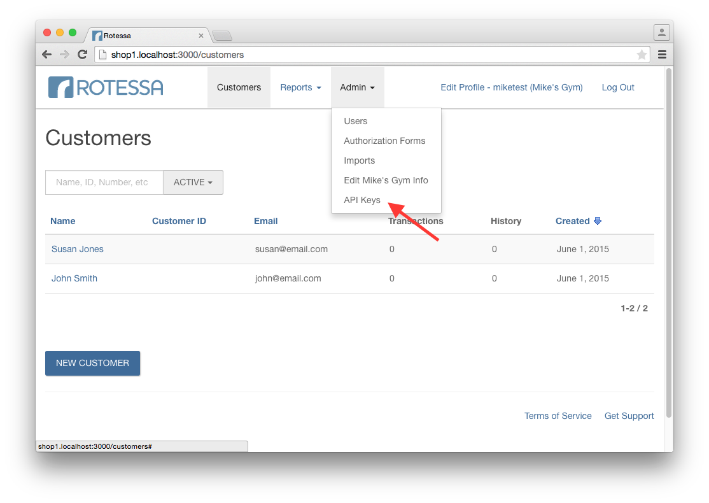
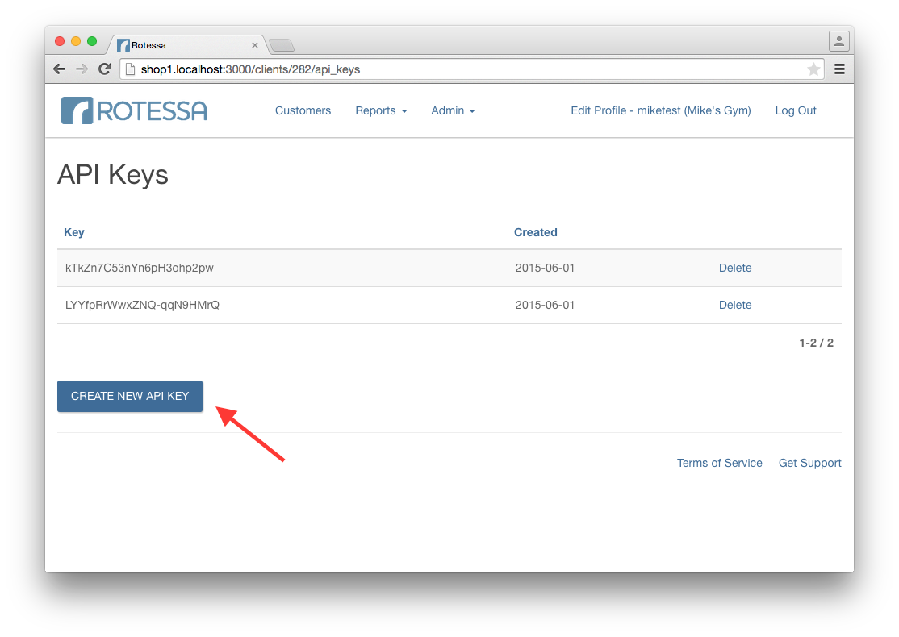

# Introduction

The Rotessa API allows access to the core Rotessa platform. The endpoints allow you to manage customers and transactions in the Rotessa system. Typical use of the API is as follows:

- Obtain access to the API by <a href="#generate-an-api-key">generating an API key</a>.
- <a href="#create-a-customer">Create a customer</a> for which you would like to withdraw funds.
- For each customer <a href="#create-a-transaction-schedule">create a transaction schedule</a>, which specifies the amount and frequency of fund withdrawals. Transaction schedules generate <a href="#financial-transactions">financial transactions</a>, which are the individual transaction results of a schedule..
- Query the status of your transactions via the <a href="#show-transaction-report">transaction report</a> to determine payment success or failure.

# Authentication

Rotessa uses API keys to allow access to the API. API keys are unique tokens used by the API, placed in the request header that grant access to your Rotessa resources.

## Generate an API key

> To authorize, use this code:


```shell
# With shell, you can just pass the correct header with each request
curl "rotessa_endpoint"
  -H "Authorization: Token token=\"your_api_key\""
```

> Make sure to replace `your_api_key` with your API key.


Access the API Keys from your Rotessa admin portal:
<a href=images/api_keys_1.png>
  
</a>

Existing API keys can be revoked and generated. Click Create API Key:
<a href=images/api_keys_2.png>
  
</a>

Rotessa expects for the API key to be included in all API requests to the server in a header that looks like the following:

`Token token="your_api_key"`

<aside class="notice">
You must replace `your_api_key` with your personal API key.
</aside>
